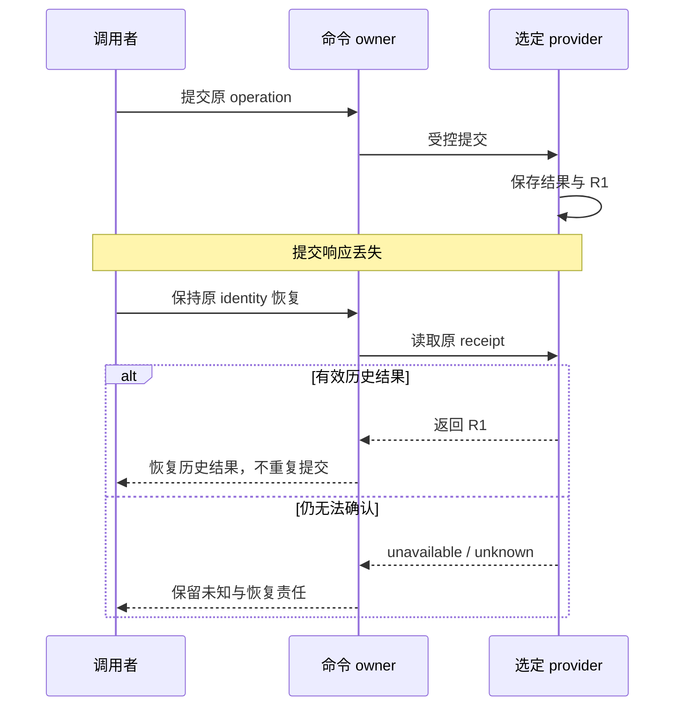

# 恢复、自修复与运行边界

上一章把一次受治理的 Turn 拆开，看它怎样停在可辨识的位置。本章把尺度拉长到几十上百轮，
回答同一个问题剩下的那一半：当 session、Host、workspace 与外部事实都可能变化时，系统凭什么
知道该不该继续、复现什么、什么时候承认自己需要修。

约束二（每次中断必须停在可辨识位置）在本章跨轮展开：Turn 内部要停在可枚举的相位上，
而一条长程链要停在可复现的行动条件上。

## 从一个坏的结局开始

先看一个比崩溃更安静的坏结局。它在已经"管理得很好"的系统里发生：

```text
09:00  Goal：让 feature branch 通过 review 并合入。acceptance 写得很清楚。
第 11 轮  产出 `notes/analysis.md`。文件真实，diff 真实，writeback 成功。
第 17 轮  补了 3 个 fixture。测试真的跑了，真的通过。
第 24 轮  重写了 README 的概述段落。
第 31 轮  加了一份 `roadmap.md`，把剩下的工作拆成 12 条。
第 38 轮  又整理了一次目录结构。
18:00  quota 用尽。分支的 review 状态与 09:00 完全一致。
```

这 42 轮没有一轮违规。每轮都读了状态、选了 Todo、交付了 artifact、跑了验证、写回了证据。
问题是它们的 `delivery_outcome` 全是 `surface_only`：有 artifact，但没有推进任何 acceptance。
没人把"写了 12 条 roadmap"当成验收条件，而系统直到 quota 见底都没问过这个问题。

这就是**目标漂移**（goal drift）。杀不死长程 Agent 的通常不是崩溃，而是一条每轮都不算错的
路径，累积几十轮后把资源全部花在离 Goal 很远的地方。崩溃至少会留下一个孤立的失败；
漂移留下的是一串成功。

## 为什么"定期反思一下"撑不住

直觉反应是给 Agent 加一条自查：每 N 轮回头看一次，确认还在推进目标。三个地方会塌：

**自评没有独立性。** 让 Agent 判断自己刚才那轮有没有推进 acceptance，它用的是同一套推理，
很容易得出同一套结论。它把 `notes/analysis.md` 标成 `outcome_gap` 时，并没有撒谎，
它只是真的相信了。

**没有 baseline 的"没变化"不可证伪。** 一个从不检查目标的系统和一个检查后确认没变的系统，
在状态上完全一样。如果"未发现漂移"既可以是结论也可以是默认值，这条检查就没有信息量。

**缺席不构成证据。** "用户没抱怨""Gate 没触发""没有失败"都只说明没人看。而上面那条 timeline
的特征恰恰是没有任何一处冒烟。

所以设计目标是把漂移变成**有据可查的断言**，靠的不是让 Agent 更认真地反思。

## 设计

### 恢复的是行动条件，不是旧思维过程

**这是本章的核心论点。** 恢复的目标不是把 Agent 的旧推理重新载入，而是重建它当时面对的
行动条件。旧思维过程既不可获取、也不可信任；行动条件则可以被写成状态、被重新探测、被独立复核。

**为什么这个区别重要。** 如果想的是"恢复旧思路"，那么恢复正确与否无法验证：你没有任何
基准来比对一段消失的推理。如果想的是"恢复行动条件"，恢复就退化成一组可检查的断言：
Goal 是什么、acceptance 有没有闭合、哪个 Todo 还开着、证据绑在哪个 revision 上、当前
workspace 和授权还在不在。这些断言要么成立要么不成立，而且多数不需要读 transcript。

**为什么它比看起来更强。** 只重建"思路"的系统在接手方是另一个 Agent、另一个 Host 时就会
失效，因为思路没有跨模型的表示。只重建行动条件的系统天然跨 session、跨 Host、跨 peer：
它复现的是"现在允许做什么"，而这件事本来就与谁在想无关。

假设 Codex CLI 在本地测试通过后关闭，第二天由 Codex App 接手。新 session 不需要逐字获得
旧 transcript，但至少要重建这七类行动条件：

- Goal、acceptance 与当前 per-Agent Vision；
- open Todo、dependency、claim 与 continuation；
- unresolved Gate 与 decision scope；
- evidence 所绑定的 command、revision 与 freshness；
- current worktree、Host capability 与 write scope；
- external handle、readback 与 monitor due state；
- current interaction contract 与 stop condition。

### 同一任务：响应丢失之后恢复哪一项 {#receipt-recovery}

假设 T1 的某项受控操作已经提交 R1，但响应丢失。调用者没有成功回复，仍可能存在持久结果。下面的 recovery 只读回原 operation，不重新执行整个 Host 任务。



已确认 `absent` 后是否可以执行，仍由该操作的当前合同决定。这与“未知时自动重试写入”不同。这个分工的代价是维护可读回回执，以及在 provider 不可用时接受等待。

恢复 R1 后也要重读 T3 的条件：CI 和 G1 是否已满足，是否已有新 commit。恢复历史事实和批准后续发布是两次判断。

### 复现什么，重新探测什么

这七类里，有一半可以从 durable project state 复现，另一半必须在当下重新探测。这个划分本身
就是"行动条件"论点的落地：

| 可复现的事实 | 必须重新探测的事实 |
| --- | --- |
| Goal identity、Todo lineage、Gate resolution | 当前 checkout 与 uncommitted diff |
| run/evidence refs、旧 receipt | 当前 CI、PR、Issue 或 cloud state |
| registered Agent 与 policy | 当前 Host capability 与登录状态 |
| previous scheduler proposal | 当前时间、monitor due 与 execution context |

分界线由旧的 invariant 和 verified outcome 共同决定。旧 receipt 证明某个动作曾在绑定输入和
revision 下成功，不证明外部世界仍保持不变。旧 claim 也不证明 Agent 仍在运行。把这两者当成
可复现事实，就是在用过去的行动条件替代现在的。

### 四个动作解决四种失败

先把它们分开，因为混用会掩盖真正的失败类型：

**Continuation.** 目标、frontier 和协议没有实质变化，下一轮沿已有 Todo 继续一个新的
bounded segment。即使 Host session 可以 resume，也要重新运行 current guard。

**Retry.** 目标动作仍然合法，但 transport、timeout 或临时环境失败。Retry 必须有幂等边界、
attempt identity 和 readback，避免把第一次已成功但响应丢失的 effect 再执行一次。

**Replan.** 工作语义需要改变，常见触发有：Goal / acceptance / Vision 漂移；frontier 耗尽但
acceptance 仍未满足；dependency 已满足而旧 Todo 需要 successor；新 evidence 推翻旧方案；
多轮只产生 surface progress；当前 peer 的 role scope 不再覆盖下一步。

Replan 必须产生可观察 delta：更新 Todo、Vision、acceptance、successor、supersede 或
no-follow-up。只写"已重新评估，继续原计划"不足以清除 replan obligation。

**Self-Repair.** 目标工作可能仍然正确，但控制面本身不一致，例如：event source 与 status
projection 不一致；user Todo count 存在而具体 Gate payload 缺失；stale Next Action 指向已完成
Todo；wrong worktree 仍被当成 delivery workspace；monitor 缺 target、cadence 或 bounded
observation handle；writeback/spend lineage 不完整。

Self-repair 修复状态、projection 或 boundary，不降低 Gate，也不凭猜测补 permission。

### Replan 与 Dreaming 的边界

两者都改变对未来的想象，只有一个是可执行的：

- **Replan** 是当前目标图上的机器可见变化：新增或删除 Todo、改 Gate、写 successor、更新
  acceptance。它产生能被 quota 和 frontier 直接读取的新事实。
- **Dreaming** 探索未来可能性：一个新分支方向、一个替代方案、一个未验证的假设。它只能产生
  proposal，不能替代当前 runnable frontier。

关键区分：agent 在 dreaming 里写了一组新 Todo 草稿，但没有通过 lifecycle command 把它们写进
当前 goal 的 frontier。此时它们尚未成为可执行任务，下一轮 quota 不会选中它们。跳过 replan 让
dreaming proposal 冒充可执行任务，quota 就会继续在错误 frontier 上运行。

正确流程是：dreaming 产生 proposal，operator 或自主 replan 判断是否接受，接受后通过
lifecycle command 写入 goal 图，下一轮 quota 才可见。

### Turn 不构成进展单位

长程任务不会因为 Turn 数量增加而自动接近 Goal。一次 Turn 可能只是合法等待，也可能产生大量
diff 却没有增加能改变下一步判断的证据。判断是否在收敛，要同时区分四种状态：

| 状态 | 可观察特征 | 正确动作 |
| --- | --- | --- |
| 合法迭代 | 输入、revision 或 evidence 已变化，下一步因此可区分 | 执行一个新的 bounded Turn |
| 外部等待 | 没有当前动作，但恢复条件、target 与 next due 明确 | Monitor、backoff、quiet |
| 目标漂移 | 局部指标或当前 Todo 开始替代 Goal / Acceptance | Vision checkpoint、acceptance audit、replan |
| 局部循环 | 重复同类动作，却没有新增信息、状态 delta 或失败区分度 | 停止重复，diagnose、replan 或 self-repair |

"重复"本身不构成循环。PR checks 从 pending 变成 failed 后再次处理，是合法迭代；外部训练任务
仍在运行时按 due time 观察，是合法等待。只有输入事实、可归因 evidence 和下一步计划都没有
material 变化，却继续消耗同类 Turn，才是空转。

### Material Evidence Delta

六条收敛不变量之外，还需要一个判定"这一轮值不值得花资源"的口径。一次值得继续消耗资源的
Turn，应至少推进下面一项 Material Evidence Delta：

- 新 observation 改变了当前领域判断；
- 新 evidence 排除或支持了一个可检验解释；
- 已验证 artifact 满足了一项 acceptance；
- successor、Gate、blocker、Vision 或 no-follow-up 改变了 machine-visible frontier；
- Provider effect 得到与 proposal identity、revision 和 readback 绑定的 receipt；
- 明确证明当前只能等待，并写入 target、cadence 与恢复条件。

单纯增加日志、重写总结、刷新同一 projection、重复一个 unchanged poll，或产生无法绑定当前
revision 的测试结果，都不构成 material progress。它们可以是诊断步骤，但不能冒充 Goal 推进。

### Outcome Floor：防止微小动作冒充推进

multi-file diff 仍可能只是 surface-only 改动。LoopX 用两层粒度区分"做了工作"和"推进了目标"：

**Delivery Scale**（交付规模）：

| 值 | 含义 |
| --- | --- |
| `test_only` | 仅运行测试，未产生新 artifact |
| `single_surface` | 修改单个文件或表面 |
| `multi_surface` | 跨多个文件或模块 |
| `implementation` | 产生可验证的功能实现 |

**Delivery Outcome**（交付成果）：

| 值 | 含义 |
| --- | --- |
| `surface_only` | 有 artifact 但未推进 acceptance |
| `outcome_gap` | 推进了某个子目标但未闭合 |
| `outcome_progress` | 推进了 primary goal 的某个 acceptance |
| `primary_goal_outcome` | 直接闭合一个 primary acceptance |

关键规则：`multi_surface` 交付仍可能是 `surface_only` 成果。连续 `surface_only` 或
no-progress 之后，quota 会要求下一次交付必须产生真正的 outcome 或 self-repair。这并非惩罚
"写得多"，而是防止系统用表面活动替代目标推进。

和 Material Evidence Delta 的关系：outcome 是 evidence delta 的语义分类。一次交付如果既不改变
machine-visible frontier，也不推进 acceptance，那它两样都没有。

### 六条收敛不变量

可以用六个问题 review 一条长程链，它们把 Safety 与 Liveness 放进同一个闭环：

1. **方向：** 当前 Todo 仍能追溯到 Vision、Goal 与 Acceptance 吗？
2. **权限：** transition 作用于正确对象，并由正确 Agent、Gate 或 Host capability 授权吗？
3. **证据：** observation 是否 fresh，evidence 是否与 revision、scope 和 evaluator 绑定？
4. **Delta：** 本轮是否改变了可重放事实、frontier 或等待条件？
5. **活性：** acceptance 未满足而 frontier 为空时，是否形成 wait、replan、repair 或明确 stop？
6. **终局：** terminal 是否同时关闭 Todo、Monitor、Gate、successor、receipt 与 acceptance gap？

Safety 防止错误推进，Liveness 防止系统非常谨慎地永久卡住。

Successor 把局部完成接回 Goal；Monitor backoff 避免等待时热轮询；Replan 改变失效路线；
Self-Repair 修补控制面缺口；Terminal audit 防止"Todo 都勾完了"被误报为完成。

更完整的双 Showcase 回放、Evidence Delta 判据、independent oracle 与收敛实验见
[长程任务如何收敛](/loopx/docs/development/control-plane-course/topic-long-horizon-convergence/)。

证据、Refresh、Spend 与 repair delta 的源码路径见
[Control-Plane Course 第 8 讲](/loopx/docs/development/control-plane-course/08-evidence-refresh-and-self-repair/)。

一份机器可读的协议把这些事实固化成字段，是
[`long_horizon_agent_state_protocol_v0`](https://github.com/huangruiteng/loopx/blob/main/docs/reference/protocols/long-horizon-agent-state-protocol-v0.md)。

它的 Source Protocol 与 Projection Protocol 是分开的，projection 声明
`"projection_is_writable": false`，并在 Acceptance Checks 里要求"validation and writeback precede
quota spend"和"candidate todos are not silently promoted"。

### Projection Gap 的处理顺序

两个表面冲突时，先定权威来源，再修拥有者：

```text
detect mismatch
  -> identify authoritative source
  -> classify source-write / projection / migration / freshness failure
  -> repair through the owning protocol
  -> recompute and validate
  -> rerun quota
```

例如工作台显示 Todo 已完成，而 status 仍显示 open：

1. 先确认这个 Goal 使用 legacy Markdown 还是已选择的 canonical provider；
2. 检查当前 source 的 Todo 与完成 evidence，排除 scope、版本和列表裁剪差异；
3. 若只有手工编辑，按原 lifecycle owner 修复缺失的验收或回执，不把勾选当成有效交付；
4. 若 source 已提交，修复对应 projection，再读 status 与 quota；
5. 一致性问题解决前，不执行依赖该结果的 successor。

不要同时手工修改 Markdown、dashboard fixture 和 status cache 来"让页面看起来一致"。

### Vision Checkpoint 与 Acceptance Gap

[`goal_vision_replan_contract_v0`](https://github.com/huangruiteng/loopx/blob/main/docs/reference/protocols/goal-vision-replan-contract-v0.md)
要求使用 Vision 的 Agent 在 material refresh 时记录五种结果之一：Vision 被 patch；Vision
保持不变并给出原因；Vision 已满足并 retired；由 successor supersede；当前 role 不需要 Vision。

缺失 required checkpoint 会形成 `vision_checkpoint_missing` acceptance gap。它要的不是更多愿景
prose，而是证明本轮局部推进没有让 lane 偏离 Goal。

Goal-level replan 先于 monitor quiet 或 agent-scope wait。否则系统可能在"当前没有可运行
Todo"时静默等待，却遗漏 acceptance 仍未闭合的事实。

### Vision unchanged 的诚实条件

声称"Vision 不变"并不总是安全。首次 material closeout 没有 baseline，声称 unchanged 会被判为
`missing_required`：系统无法区分"确实没变"和"从未检查过"。因此第一次必须写 vision patch，
不能靠"不变"绕过。

后续轮次声称 unchanged 需要满足：存在可比较的 baseline（上一轮已写入的 vision）；本轮
delivery 确实没有改变任何 vision 前提；写回时明确引用 baseline revision 和"不变"理由。

baseline 缺失而 agent 仍声称 unchanged 时，quota 会产生 `vision_checkpoint_missing` gap。
这是为了防止 agent 在 never-checked 状态上积累错误假设。完整失败回放见
[Control-Plane Course 第 8 讲](/loopx/docs/development/control-plane-course/08-evidence-refresh-and-self-repair/)。

### Terminal Closure

Todo 全部 done 只说明当前列表结束，不自动证明 Goal 完成。Terminal audit 是一个严格合取：

```text
open todos = 0
due monitors = 0
unresolved blocking gates = 0
pending successors = 0
replan obligations = 0
acceptance gaps = 0
retryable postconditions = 0
required external readbacks are fresh
```

如果 acceptance 已满足且没有 follow-up，记录结构化 no-follow-up；如果仍有工作，创建 successor；
如果外部结果尚未确定，保持 monitor 或 blocker。不要为了让 Goal"看起来完成"而删除未闭合状态。

### Rollback 与补偿型 transition

Terminal closure 处理成功路径的收尾；一条已经产生风险的交付还需要补偿路径。
[`rollback_packet_v0`](https://github.com/huangruiteng/loopx/blob/main/docs/reference/protocols/rollback-packet-v0.md)
就是这份公开安全的补偿协议，它回答五个问题：哪些可见或持久状态受影响；由哪个 todo、
rollout event、commit、PR 或外部资源造成；下一步安全动作是 revert、fix-forward patch、
状态修正、support request、external cleanup 还是 monitor；谁必须批准受保护步骤；哪些验证
和 public/private 检查证明补偿完成。

它的定位是 plan 与 evidence packet，而非执行许可。安全规则写得很直白：packet 不授权
destructive git 命令、force push、生产动作或外部删除；`history_rewrite` 需要显式的人工批准
和恢复点；provider 侧只读 ref、cached view 或搜索索引属于 external cleanup，如果普通
repository 命令删不掉，packet 必须保留一个 user/support gate 或 monitor Todo。

和本章主题直接相关的一条，是它要求 rollback 以"未来的补偿动作"出现，而非隐藏删除。
删除会让状态看起来干净；补偿把"还欠着什么"变成可见的 Todo、Gate 与验证命令。

### 四种运行责任

长期 Agent 系统容易把所有组件都称为"工具"或"插件"。LoopX 使用四种运行责任：

| 责任 | 合同 |
| --- | --- |
| Agent / Executor | 在 Host 中规划并执行一个被允许的 bounded action |
| Provider | 调用外部系统，返回 observation、effect result 或 readback |
| Capability | 定义 caller outcome，规范 Provider 输出，应用 domain policy |
| LoopX Kernel | 接受或拒绝 proposal，拥有通用 Goal/Todo/Gate/Quota/Recovery state |

正常流向并非"Agent 调工具后直接写完成"：

```text
Agent -> Capability -> Provider -> external system
Provider readback -> Capability validation/proposal -> LoopX transition
```

Capability 描述调用者可依赖的 outcome contract；Provider 实现或访问外部系统；Kernel 保持
跨领域生命周期。Issue-Fix、Explore 等领域结果可以拥有自己的 Domain State，但不能反向拥有
通用 quota、Gate 或 permission。

### Extension 是交付与生命周期边界

**Extension** 拥有独立的 packaging、installation、enable/disable、upgrade/rollback、
compatibility 与 provider ownership。

它不构成第五种运行责任，也不自动获得 domain authority：

```text
Extension package
└── delivers Provider
      └── participates in Agent -> Capability -> Provider -> Kernel flow
```

对于零权限、确定性的 standalone Extension，LoopX 可以通过 managed runtime 调用 bounded
request/response command。一旦操作需要 read、write、send、publish 或 manage authority，
就必须进入能检查 permission、decision scope 与 domain policy 的 Capability 或领域命令。

"安装成功""doctor ready"和"有权执行某次 effect"是三个不同状态。

### 谁拥有哪些事实

**LoopX canonical state** 拥有工作生命周期事实：Goal、Todo、Gate；claim、lease、dependency 与
successor；quota、monitor、scheduler hint；accepted evidence pointer 与 receipt；event
lineage、Vision checkpoint 和 projection inputs。

**外部系统** 继续拥有自己的事实：Git 拥有 commit 与 branch；GitHub 拥有 PR、Issue 与 check
当前状态；CI 拥有 job 结果；cloud service 拥有资源实际状态；Host 拥有 session 与真实唤醒效果。
LoopX 可以保存 bounded observation、readback 和 evidence pointer，但不能让一份过期复制品
替代外部权威。

**Host 与 Agent** 分别拥有 session、模型 Turn、工具表面、实际唤醒机制，以及当前推理与临时
计划。两者都不能成为项目 Goal state 的唯一持有者。

Host 应服从 current `interaction_contract` 与 `scheduler_hint`，不能把项目专属控制逻辑永久
复制进 heartbeat prompt。Agent 也不能因为"上一轮做过类似动作"而推断本轮仍有 authority。

### Public 与 Private Boundary

项目状态常包含不能公开提交的内容：本地 registry 与 active goal state；task lease、Host
session handle；raw transcript、trajectory 与 verifier tail；credentials 与 provider private
config；本机路径、内部链接和私有组织叙事；未脱敏的外部 evidence。

项目接入章要求把以下目录排除在 Git 之外：

```text
.loopx/
.codex/goals/
.local/
```

忽略规则只是第一层保护。公开提交前仍要扫描 credentials、absolute paths、raw logs、
private links 和 runtime artifacts。需要长期公开保存的结论应先压缩成 public-safe behavior、
schema、fixture 或 evidence pointer。

Handoff 也不能把 private material 复制到另一个公开 packet。它只传 stable ids、bounded refs、
freshness、omission note 与重新获取材料所需的合法路由。

### LoopX 不替代什么

LoopX 不替代：Agent runtime（模型仍负责推理）；Host scheduler（Host 仍负责实际唤醒）；Git
（代码历史和 branch 仍由 Git 管理）；CI（测试执行和 check 状态仍由 CI 管理）；外部服务认证
（TurnEnvelope 和 receipt 都不充当 security token）；domain system（LoopX 不伪造外部资源事实）；
independent validator（Executor 自述不能单独证明 completion）。

这个边界支撑后续两条实践主线：**接入现有项目**，复用这些协议而不修改 LoopX 源码；以及
**开发者贡献**，从调用者结果和协议选择 owning boundary，交付 Control Plane、
Capability/Domain State、Provider、Host/Runner、Projection/Dashboard、Docs/fixtures 或
Extension。

Extension 是开发者贡献中的独立 packaging/lifecycle 路径，不构成所有贡献的统一抽象。

## 代价与边界：这套设计放弃了什么

上面每条机制都换来一个性质，代价需要说清楚，它们决定你什么时候不该指望这套机制。

**代价一：self-repair 会让系统把时间花在修自己。** 控制面缺口是真实工作，但修缺口不推进
acceptance。一个每隔几轮就发现 projection 不一致的系统，会把整段预算用在维持自己的可读性上。
所以 repair 必须由一条具名的、可复现的不一致触发，而非由"感觉状态有点乱"触发。

**代价二：证据采集本身消耗资源。** fresh readback、independent oracle、matched baseline
每一项都要花 Turn。判据太严，系统会把预算烧在证明自己没动上；判据太松，漂移又回不来。
"没有 material delta 就不 spend"因此是一条双向约束。

**代价三：漂移的发现是滞后的。** 连续 `surface_only` 是事后信号，而非事前预测。系统需要几轮
才会形成一次 drift streak，而这几轮的花费已经发生。收敛不变量降低的是漂移的持续长度，
而非它的发生概率。

**代价四：诚实终态需要证明。** complete、blocked、retired、closed-with-gap 各有各自的证据
要求，比"没有更多想法了"昂贵得多。

**边界一：什么时候应该停下来问人。** 系统不自己猜的地方包括：`history_rewrite` 等受保护的
destructive 动作；provider 侧 cached view、只读 ref、搜索索引这类外部清理；权限或 authority
缺失；Gate 带有真实 decision scope；acceptance 本身需要人重新定义。这些的共同点是：
系统手上没有能判定对错的依据，继续自主推进只会把不确定性写进状态。

**边界二：self-repair 不能降低 Gate。** 它修状态、projection 或 boundary，不修改 Gate 的
判定，也不凭猜测补 permission。一条"为了让流程继续"而放松的 Gate 会让后面的所有证据失效。

**边界三：不变量需要真实 evidence，而 evidence 有采集成本。** 六条不变量问的是"你凭什么说"，
所以它们拦得住自证，也因此在缺证据时会拦下本来正确的工作。这是有意的取舍。

**边界四：循环判据是保守的。** 形成一次 drift 判定需要连续多条 `completed`、signal 为真、
且绑定同一个 pinned contract revision 的 receipt，中间不能夹 unevaluated transition。判据从宽
会让系统频繁误判路线，判据从严会让明显的空转拖更久。

## 具名失败：这些约束拦住了什么

抽象地谈"收敛"和"可恢复"没有说服力。下面四个场景各有对应测试，可以直接运行。

**缺失的 checkpoint 不需要再花一个工作 Turn。** `tests/control_plane/test_refresh_checkpoint_recovery.py`
针对的是同一个 Turn 写完 writeback、却留下 required vision checkpoint 未满足的状态。
它断言补交是幂等的：两个并发调用只产生一次 append
（`assert sum(result["appended"] for _, result in results) == 1`），重放不再写入
（`replay["appended"] is False` 且 `replay["idempotent_replay"] is True`），settlement identity
保持不变（`assert repaired["settlement_identity"] == first["settlement_identity"]`），原始
writeback 字节未被改写（`assert Path(first["json_path"]).read_bytes() == original_bytes`）。
两条补交路径都不 spend（`assert _spend_run_count(runtime) == 0`）。这正是"恢复行动条件"的
可执行版本：修的是那条未闭合的条件，而非那轮推理。

**旧的 ACK 不能关掉新生成的 duty。** `tests/control_plane/test_refresh_state_replan_gate.py`
的写时 gate 拒绝在 replan obligation 到期时提交 maintenance writeback，并且区分"重复 baseline"
与"新的 typed semantic delta"。它断言重新武装后的 obligation 只接受它自己的新 successor
（`assert rearmed_id != original_id`），
已完成的或错误来源的 successor 不能关闭它，而一个只声明 `--repair-delta-kind` 的 claim
也过不去（`with pytest.raises(ValueError, match="typed semantic delta")`）。

**返工必须要么消失，要么被算清。** `tests/control_plane/test_shadow_cursor_recovery_e2e.py`
把"已消费的位置"和"最后应用过的 digest"当成两个独立事实。writer 在 mutation 未应用时崩溃，
cursor 已经前进，`last_partition_digest` 仍然保持 `None`；恢复时那些位置被重新记为 `no_op`
receipt（`assert sum(tx['receipts'][0]['no_op'] is True for tx in transactions[1:]) == abandoned`）。
伪造的 applied digest 会让每个消费者 fail closed
（`assert result['ok'] is False and result['reason_code'] == 'outbox_cursor_unproved'`），
而且不动一个字节的 authority 数据（`assert after == before`）。

**一条失败不能只被"修好了"，还要能被重放。** `tests/control_plane/test_effect_program_incident_replay.py`
用一份冻结的公开语料把四类事件回放到真实的 turn-driver 与 quota settlement adapter 上。
语料恰好覆盖四条不变量：`INV-WRITEBACK-BEFORE-SPEND`、`INV-FAILURE-SHORT-CIRCUIT`、
`INV-ONE-EFFECT-IDENTITY`、`INV-AT-MOST-ONCE-SETTLEMENT`
（`assert {case["invariant_id"] for case in corpus["cases"]} == REQUIRED_INVARIANTS`），
每个 case 的完整观测必须逐字段等于预期（`assert observed == case["expected"]`）。语料本身也
受 public/private 约束：任何以 `/` 开头、含 `://` 或含 `@` 的值都会被拒绝。

配套的可核对入口是 `examples/long-horizon-agent-state-protocol-smoke.py`，它校验协议里
`"projection_is_writable": false`、"candidate todos are not silently promoted" 等契约字符串，
并拒绝含有本机路径或私有组织用语的文本。

## 不变式

读完这一章，你应该能带走五句可以自己检查的话。

1. **恢复重建的是行动条件，不是旧思维过程。** 如果一个恢复流程要求你还原某段消失的推理才能
   继续，那只能算猜测。
2. **可复现的事实与必须重新探测的事实之间有明确分界。** 旧 receipt 和旧 claim 都不能替
   当前状态作证。
3. **没有 Material Evidence Delta 的 Turn 值不起它的花费。** 有 artifact 不等于推进了
   acceptance；连续 surface-only 之后，下一步必须是真正的 outcome 或 self-repair。
4. **Terminal 是一个严格合取，而非"Todo 全勾完"。** 观察到一个 Goal 在 acceptance gap、
   due monitor 或 pending successor 仍存在时被标记完成，那是缺陷。
5. **补偿以未来的动作出现，不以隐藏删除出现。** 一条"已经清理干净"的历史，如果说不清它欠
   哪个 Todo 或 Gate，就没有被补偿。

这五句和上一章的六句回答的是同一个问题，只是尺度不同：单轮里，系统凭什么知道该不该动、
动到哪了；长程里，系统凭什么知道还在靠近目标，以及什么时候该停下来问人。
