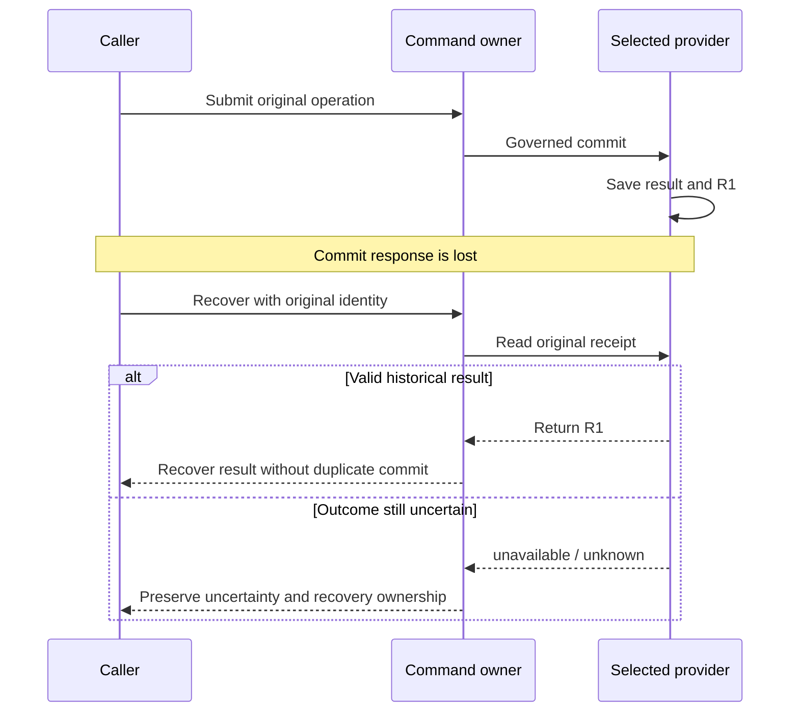

# Recovery, self-repair, and runtime boundaries

The previous chapter took one governed turn apart and watched it stop at an identifiable position. This
chapter stretches the scale to dozens or hundreds of turns and answers the other half of the same
question: when the session, the Host, the workspace, and external facts have all changed, how does the
system know whether to continue, what to replay, and when to admit it needs repair?

Requirement two (every interruption stops at an identifiable position) expands across turns here. Inside
a turn, failure stops on an enumerable phase. Across a long-running chain, it stops on a reproducible
action condition.

## Start from a bad ending

Here is a bad ending quieter than a crash. It happens in systems that are already "well managed":

```text
09:00  Goal: get the feature branch through review and merged. Acceptance is explicit.
Turn 11   Produced `notes/analysis.md`. Real file, real diff, writeback succeeded.
Turn 17   Added 3 fixtures. The tests genuinely ran and genuinely passed.
Turn 24   Rewrote the overview section of the README.
Turn 31   Added `roadmap.md`, splitting the remaining work into 12 items.
Turn 38   Reorganized the directory structure again.
18:00  Quota exhausted. The branch's review state is exactly what it was at 09:00.
```

None of those 42 turns broke a rule. Each read state, selected a Todo, delivered an artifact, ran
validation, and wrote back evidence. The problem is that every one of them was classified
`surface_only`: an artifact existed, but no acceptance advanced. Nobody had written "produce a 12-item
roadmap" into the acceptance conditions, and the system never asked that question until quota ran out.

This is **goal drift**. What kills long-running agents is usually not a crash but a path where no single
turn is wrong, and which after dozens of turns has spent the whole budget far from the Goal. A crash at
least leaves one isolated failure behind. Drift leaves a string of successes.

## Why "reflect periodically" does not hold up

The instinctive fix is a self-check: every N turns, look back and confirm you are still advancing the
goal. Three things collapse:

**Self-assessment has no independence.** Asking the agent whether its own last turn advanced acceptance
uses the same reasoning that produced the turn, so it readily reaches the same conclusion. When it
labels `notes/analysis.md` as `outcome_gap`, it is not lying. It genuinely believes it.

**"Nothing changed" without a baseline is unfalsifiable.** A system that never checks the goal and one
that checks and confirms no change are in identical states. If "no drift found" can be either a verdict
or a default, the check carries no information.

**Absence is not evidence.** "The user hasn't complained," "no Gate fired," and "nothing failed" all say
only that nobody was watching. The timeline above has no smoke anywhere.

So the design goal is to turn drift into a **documented assertion**, not to ask the agent to reflect
harder.

## The design

### What recovery rebuilds is action conditions, not the old thought process

**This is the chapter's central claim.** The goal of recovery is not to reload the agent's earlier
reasoning; it is to rebuild the action conditions it faced. The old thought process is neither
retrievable nor trustworthy. Action conditions can be written as state, inspected again, and checked
independently.

**Why the distinction matters.** If recovery means "restore the old line of thinking," its correctness
cannot be verified: there is no baseline to compare a vanished inference against. If recovery means
"restore action conditions," it degrades into a set of checkable assertions: what the Goal is, whether
acceptance is closed, which Todos are open, which revision the evidence binds to, whether the current
workspace and authority still hold. Those assertions hold or they do not, and most of them need no
transcript.

**Why it is stronger than it looks.** A system that rebuilds only "the line of thinking" fails the
moment the next owner is a different Agent on a different Host, because a line of thinking has no
cross-model representation. A system that rebuilds action conditions works across sessions, Hosts, and
peers by construction: it reproduces what is permitted now, and that was never a fact about who is
thinking.

Assume Codex CLI closes after local tests pass and Codex App takes over the next day. The new session
does not need a verbatim transcript, but it must rebuild these seven classes of action condition:

- Goal, acceptance, and current per-Agent Vision;
- open Todos, dependencies, claims, and continuation;
- unresolved Gates and decision scopes;
- commands, revisions, and freshness attached to evidence;
- current worktree, Host capabilities, and write scope;
- external handles, readbacks, and monitor due state;
- current interaction contract and stop condition.

### Running task: recover the missing result {#receipt-recovery}

Suppose a governed T1 operation commits R1 but its response is lost. Missing success output can coexist with a durable result. This recovery reads the original operation; it does not rerun the entire Host task.



Confirmed absence is handled by the operation's current contract. Unknown outcomes do not justify a blind write retry. This division costs receipt maintenance and may require waiting while the provider is unavailable.

After R1 recovery, reread T3's conditions: CI, G1, and any newer commit. Recovering history and authorizing publication are separate decisions.

### What replays, and what must be inspected again

Half of those seven classes replay from durable project state. The other half must be inspected now.
That split is the action-conditions argument made concrete:

| Replayable facts | Facts to inspect again |
| --- | --- |
| Goal identity, Todo lineage, Gate resolution | Current checkout and uncommitted diff |
| Run and evidence references, old receipts | Current CI, PR, Issue, or cloud state |
| Registered Agents and policy | Current Host capability and login state |
| Previous scheduler proposal | Current time, monitor due state, and execution context |

The line between the columns is drawn by old invariants and verified outcomes together. An old receipt
proves that an action succeeded for bound input and revision. It does not prove the external world
remains unchanged. An old claim does not prove the Agent is still running. Treating either as a
replayable fact substitutes a past action condition for the present one.

### Four actions for four different failures

Separate them first, because conflating them hides the real failure kind:

**Continuation.** Goal, frontier, and protocol semantics are materially unchanged. A new turn performs
another bounded segment on the existing Todo. Even when a Host session can resume, current guards must
still rerun.

**Retry.** The action remains legal, but transport, timeout, or temporary environment failure prevented
a reliable result. Retry needs an idempotency boundary, attempt identity, and readback so an
already-successful effect is not executed again after its response was lost.

**Replan.** The work semantics must change. Common triggers: Goal, acceptance, or Vision drift; an
exhausted frontier while acceptance remains open; a satisfied dependency whose old Todo needs a
successor; new evidence that invalidates the plan; repeated surface activity without outcome progress;
a peer whose role scope no longer covers the next step.

Replan must produce an observable delta: Todo, Vision, acceptance, successor, supersession, or
no-follow-up. Writing "reassessed, continuing original plan" does not satisfy a replan obligation.

**Self-Repair.** The target work may still be correct while the control plane is inconsistent: an event
source and status projection disagree; a User Todo count exists without a concrete Gate payload; a
stale Next Action points to a completed Todo; the wrong worktree remains configured as the delivery
workspace; a monitor lacks target, cadence, or bounded observation handle; writeback and spend lineage
is incomplete.

Self-repair fixes state, projection, or boundary. It does not weaken a Gate or invent permission.

### The replan and Dreaming boundary

Both change the imagination of the future, and only one is executable:

- **Replan** is a machine-visible change on the current goal graph: add or remove Todos, change Gates,
  write successors, update acceptance. It produces new facts that quota and frontier can directly read.
- **Dreaming** explores future possibilities: a new branch direction, an alternative approach, an
  unverified hypothesis. It produces proposals only and cannot replace the current runnable frontier.

The key distinction: an agent writes draft Todos during dreaming but does not write them into the
current goal's frontier through a lifecycle command. They have not become executable tasks, and the
next quota round will not select them. Skipping replan and letting a dreaming proposal impersonate
executable tasks keeps quota running on the wrong frontier.

The correct flow is: dreaming produces a proposal, an operator or autonomous replan decides whether to
accept it, acceptance writes it into the goal graph through a lifecycle command, and the next quota
round can see it.

### A Turn is not the unit of progress

Long-running work does not approach its Goal merely because it executes more Turns. A Turn may be a
legal wait, or it may produce a large diff without adding evidence that can change the next decision.
To judge convergence, separate four operating states:

| State | Observable property | Correct action |
| --- | --- | --- |
| Legal iteration | Input, revision, or evidence changed, making the next action distinguishable | Execute one new bounded Turn |
| External wait | No current action exists, but recovery condition, target, and next due time are explicit | Monitor, backoff, and quiet |
| Goal drift | A local metric or current Todo begins to replace Goal or Acceptance | Vision checkpoint, acceptance audit, and replan |
| Local loop | The same action family repeats without new information, state delta, or failure discrimination | Stop repeating; diagnose, replan, or self-repair |

Repetition alone is not a loop. Processing a PR again after checks move from pending to failed is legal
iteration. Observing an external training task at its due time is legal waiting. Work is spinning only
when input facts, attributable evidence, and the next plan all remain materially unchanged while the
same class of Turn continues to consume resources.

### Material evidence delta

Beyond the six invariants, judging whether a Turn deserves its cost needs its own wording. A Turn that
deserves more resource consumption should advance at least one material evidence delta:

- a new observation changes the current domain judgment;
- new evidence supports or excludes a testable explanation;
- a validated artifact satisfies an acceptance condition;
- a successor, Gate, blocker, Vision, or no-follow-up changes the machine-visible frontier;
- a Provider effect receives a receipt bound to proposal identity, revision, and readback;
- the system proves that it can only wait and writes the target, cadence, and recovery condition.

More logs, rewritten summaries, a refresh of the same projection, another unchanged poll, or a test
result that cannot bind to the current revision do not constitute material progress. They may be
diagnostic steps, but they must not impersonate Goal advancement.

### Outcome Floor: preventing micro-actions from impersonating progress

A multi-file diff can still be surface-only changes. LoopX uses two levels of granularity to
distinguish "did work" from "advanced the goal":

**Delivery Scale**:

| Value | Meaning |
| --- | --- |
| `test_only` | Only ran tests, no new artifact produced |
| `single_surface` | Modified a single file or surface |
| `multi_surface` | Crossed multiple files or modules |
| `implementation` | Produced a verifiable functional implementation |

**Delivery Outcome**:

| Value | Meaning |
| --- | --- |
| `surface_only` | Artifact exists but did not advance acceptance |
| `outcome_gap` | Advanced a sub-goal but did not close it |
| `outcome_progress` | Advanced an acceptance of the primary goal |
| `primary_goal_outcome` | Directly closed a primary acceptance |

Key rule: a `multi_surface` delivery can still be a `surface_only` outcome. After consecutive
`surface_only` or no-progress deliveries, quota will require the next delivery to produce a genuine
outcome or self-repair. This is not a penalty for "writing a lot," but a guard against substituting
surface activity for goal advancement.

Relationship to a material evidence delta: outcome is its semantic classification. A delivery that
neither changes the machine-visible frontier nor advances acceptance has neither one.

### Six convergence invariants

Review a long-running chain with six questions. They hold Safety and Liveness in one loop:

1. **Direction:** Can the current Todo still be traced to Vision, Goal, and Acceptance?
2. **Authority:** Does the transition affect the correct object under the correct Agent, Gate, or Host
   capability?
3. **Evidence:** Is the observation fresh, and is evidence bound to revision, scope, and evaluator?
4. **Delta:** Did this Turn change replayable facts, the frontier, or a wait condition?
5. **Liveness:** If acceptance remains open and the frontier is empty, did the system create a wait,
   replan, repair, or explicit stop?
6. **Closure:** Does terminal state close Todos, Monitors, Gates, successors, receipts, and acceptance
   gaps?

Safety prevents an invalid transition; Liveness prevents a system from remaining cautiously stuck
forever. A successor reconnects local completion to the Goal; Monitor backoff avoids hot polling while
waiting; Replan changes a failed route; Self-Repair fixes control-plane gaps; terminal audit prevents
"all current Todos are checked" from becoming a false completion claim.

For the complete paired-Showcase replay, evidence-delta criteria, independent oracle, and convergence
experiments, use
[Long-horizon convergence](/loopx/docs/development/control-plane-course/topic-long-horizon-convergence/).
For evidence, refresh, spend, and repair delta source paths, see
[Control-Plane Course Lesson 8](/loopx/docs/development/control-plane-course/08-evidence-refresh-and-self-repair/).

A machine-readable protocol fixes these facts into fields:
[`long_horizon_agent_state_protocol_v0`](https://github.com/huangruiteng/loopx/blob/main/docs/reference/protocols/long-horizon-agent-state-protocol-v0.md).
Its Source Protocol and Projection Protocol are separate, the projection declares
`"projection_is_writable": false`, and its Acceptance Checks require that "validation and writeback
precede quota spend" and that "candidate todos are not silently promoted."

### Handle a projection gap in order

When two surfaces disagree, settle the authority first and repair through its owner:

```text
detect mismatch
  -> identify authoritative source
  -> classify source-write / projection / migration / freshness failure
  -> repair through the owning protocol
  -> recompute and validate
  -> rerun quota
```

For example, the workbench shows a completed Todo while status still shows open:

1. Identify whether this Goal reads legacy Markdown or a selected canonical provider.
2. Inspect the source Todo and completion evidence, excluding scope, revision, and bounded-list differences.
3. If only a manual edit occurred, repair missing acceptance or receipts through the lifecycle owner; a checked box is not validated delivery.
4. If the source committed, repair its projection, then reread status and quota.
5. Do not execute a dependent successor until the inconsistency is resolved.

Do not hand-edit Markdown, a dashboard fixture, and a status cache until they merely look consistent.

### Vision checkpoint and acceptance gaps

[`goal_vision_replan_contract_v0`](https://github.com/huangruiteng/loopx/blob/main/docs/reference/protocols/goal-vision-replan-contract-v0.md)
requires an Agent that uses Vision to record one of five outcomes after a material refresh: Vision was
patched; Vision remains unchanged with a reason; Vision is satisfied and retired; a successor
supersedes it; the current role does not require Vision.

A missing required checkpoint produces a `vision_checkpoint_missing` acceptance gap. Its purpose is not
to make an Agent write more visionary prose. It is to prove that local delivery did not move the lane
away from the Goal.

Goal-level replan takes precedence over monitor quiet or agent-scope wait. Otherwise the system can
remain quiet because no current Todo is runnable while acceptance still has an open gap.

### Vision unchanged honesty condition

Claiming "Vision unchanged" is not always safe. On the first material closeout there is no baseline, so
claiming unchanged is judged `missing_required`: the system cannot distinguish "truly unchanged" from
"never checked." The first round must therefore write a vision patch and cannot bypass with
"unchanged."

For subsequent rounds, claiming unchanged requires: a comparable baseline exists (the vision written in
the previous round); this round's delivery genuinely changed no vision premise; and the writeback
explicitly references the baseline revision and the "unchanged" reason.

If the baseline is missing while the agent still claims unchanged, quota produces a
`vision_checkpoint_missing` gap. This is a guard against the agent accumulating wrong assumptions on a
never-checked state. For the full failure replay, see
[Control-Plane Course Lesson 8](/loopx/docs/development/control-plane-course/08-evidence-refresh-and-self-repair/).

### Terminal closure

Every current Todo being done proves only that the list ended. A terminal audit is a strict
conjunction:

```text
open todos = 0
due monitors = 0
unresolved blocking gates = 0
pending successors = 0
replan obligations = 0
acceptance gaps = 0
retryable postconditions = 0
required external readbacks are fresh
```

If acceptance is satisfied and no follow-up is needed, record structured no-follow-up. If work remains,
create a successor. If an external result is still pending, preserve a monitor or blocker. Do not delete
open state to make the Goal look complete.

### Rollback and the compensating transition

Terminal closure closes out the success path. A delivery that already created risk also needs a
compensation path.
[`rollback_packet_v0`](https://github.com/huangruiteng/loopx/blob/main/docs/reference/protocols/rollback-packet-v0.md)
is that public-safe compensation protocol. It answers five questions: what visible or durable state is
affected; which todo, rollout event, commit, PR, or external resource caused it; whether the next safe
action is a revert, fix-forward patch, state correction, support request, external cleanup, or monitor;
who must approve protected steps; and which validation and public/private checks prove the compensation
is complete.

Its status is a plan and evidence packet, not an execution permission. The safety rules are blunt: the
packet does not authorize destructive git commands, force pushes, production actions, or external
deletes; `history_rewrite` needs explicit approval and a recovery point; and provider-owned read-only
refs, cached views, or search indexes are external cleanup, so if ordinary repository commands cannot
remove them the packet must keep a user or support gate open, or a monitor Todo.

One rule bears directly on this chapter: rollback must appear as a future compensating action, not as
hidden deletion. Deletion makes state look clean. Compensation turns "what is still owed" into visible
Todos, Gates, and validation commands.

### Four runtime responsibilities

Long-running Agent systems often call every component a "tool" or "plugin." LoopX uses four runtime
responsibilities:

| Responsibility | Contract |
| --- | --- |
| Agent / Executor | Plans and executes one allowed bounded action in a Host |
| Provider | Calls an external system and returns an observation, effect result, or readback |
| Capability | Defines a caller outcome, normalizes Provider output, and applies domain policy |
| LoopX Kernel | Accepts or rejects a proposal and owns generic Goal, Todo, Gate, quota, and recovery state |

The normal flow is not "the Agent called a tool, therefore the Todo is done":

```text
Agent -> Capability -> Provider -> external system
Provider readback -> Capability validation/proposal -> LoopX transition
```

A Capability is the outcome contract a caller can depend on. A Provider implements or accesses an
external system. The Kernel owns cross-domain lifecycle. Domain results such as Issue-Fix or Explore
can own their Domain State, but must not own generic quota, Gates, or permission in reverse.

### Extension is a delivery and lifecycle boundary

An **Extension** has independent packaging, installation, enable and disable, upgrade and rollback,
compatibility, and provider ownership.

It is not a fifth runtime responsibility and does not automatically gain domain authority:

```text
Extension package
└── delivers Provider
      └── participates in Agent -> Capability -> Provider -> Kernel flow
```

For a deterministic, zero-permission standalone Extension, LoopX can call a bounded request/response
command through the managed runtime. As soon as an operation needs read, write, send, publish, or
manage authority, it must enter a Capability or domain command that can enforce permission, decision
scope, and domain policy.

"Installed," "doctor-ready," and "authorized for this effect" are three different states.

### Who owns each fact

**LoopX canonical state** owns work-lifecycle facts: Goal, Todo, and Gate; claim, lease, dependency,
and successor; quota, monitor, and scheduler hint; accepted evidence pointer and receipt; event
lineage, Vision checkpoint, and projection inputs.

**External systems** remain authoritative for their facts: Git owns commits and branches; GitHub owns
current PR, Issue, and check state; CI owns job results; a cloud service owns actual resource state;
the Host owns its session and actual wake-up effect. LoopX may retain bounded observations, readbacks,
and evidence pointers, but a stale copy must not replace the external authority.

**Host and Agent** own the session, model turns, tool surfaces, actual wake-up mechanism, and on the
Agent's side current reasoning and a temporary plan. Neither can be the sole owner of project Goal
state.

The Host follows the current `interaction_contract` and `scheduler_hint` and must not preserve
project-specific control logic indefinitely in a heartbeat prompt. The Agent cannot infer current
authority merely because a similar action was legal in a previous turn.

### Public/private boundary

Project control state commonly contains material that must not be committed publicly: local registry
and active Goal state; task leases and Host session handles; raw transcripts, trajectories, and
verifier tails; credentials and private Provider configuration; machine paths, internal links, and
private organizational narrative; unredacted external evidence.

The project-onboarding chapter requires these directories to stay outside Git:

```text
.loopx/
.codex/goals/
.local/
```

Ignore rules are only one defense. Before publication, still scan for credentials, absolute paths, raw
logs, private links, and runtime artifacts. Durable public conclusions should first become public-safe
behavior, schema, fixtures, or evidence pointers.

A handoff must not copy private material into a public packet. It transfers stable ids, bounded
references, freshness, omission notes, and legal routes for reacquiring material.

### What LoopX does not replace

LoopX does not replace: the Agent runtime (the model still performs reasoning); the Host scheduler (the
Host still performs actual wake-up); Git (code history and branches); CI (test execution and check
state); external service authentication (TurnEnvelope and receipt are not security tokens); the domain
system (LoopX does not fabricate external resource facts); or an independent validator (an Executor's
own completion claim is not sufficient proof).

These boundaries support two later practice paths: **project onboarding**, reusing these protocols
without modifying LoopX source; and **developer contributions**, locating the owning boundary from the
caller outcome and protocol to deliver Control Plane, Capability/Domain State, Provider, Host/Runner,
Projection/Dashboard, Docs/fixtures, or Extension.

Extension is an independent packaging and lifecycle path within developer contributions, not the
unified abstraction for all contributions.

## Cost and boundary: what this design gives up

Every mechanism above buys one property by paying elsewhere. The costs matter, because they determine
when you should not expect this machinery to help.

**Cost one: self-repair spends time fixing the system instead of the goal.** Control-plane gaps are
real work, but repairing a gap does not advance acceptance. A system that finds a projection
inconsistency every few turns will spend its whole budget maintaining its own readability. Repair must
therefore be triggered by a named, reproducible inconsistency, not by a feeling that state looks messy.

**Cost two: collecting evidence consumes resources.** A fresh readback, an independent oracle, and a
matched baseline each cost Turns. Set the bar too high and the system burns budget proving it has not
moved; set it too low and drift comes back. "No material delta means no spend" cuts in both directions.

**Cost three: drift is detected late.** A consecutive `surface_only` streak is a retrospective signal,
not a forecast. Several turns must pass before a drift streak forms, and those turns have already been
paid for. The convergence invariants shorten how long drift lasts; they do not lower how often it
starts.

**Cost four: honest terminal states need proof.** Complete, blocked, retired, and closed-with-gap each
carry their own evidence requirement, and that is more expensive than "no more ideas."

**Boundary one: when to stop and ask a human.** The system does not guess at protected destructive
actions such as `history_rewrite`; external cleanup of provider-side cached views, read-only refs, or
search indexes; missing permission or authority; a Gate carrying a real decision scope; or an
acceptance condition that a human must redefine. The common thread is that the system holds no basis
for judging right from wrong, so continuing autonomously would only write uncertainty into state.

**Boundary two: self-repair cannot weaken a Gate.** It fixes state, projection, or boundary. It does
not change a Gate's verdict, and it does not invent permission. A Gate relaxed "to keep the flow
moving" invalidates every piece of evidence that follows it.

**Boundary three: invariants need real evidence, and evidence costs money.** The six invariants ask
"what entitles you to say that," which is why they block self-certification, and which is also why they
block correct work when evidence is missing. That trade is deliberate.

**Boundary four: the loop criterion is conservative.** Forming one drift verdict needs consecutive
`completed` receipts whose selected signal is true, all pinned to the same contract revision, with no
unevaluated transition between them. A looser criterion misjudges routes often; a stricter one lets
obvious spinning run longer.

## Named failures: what these constraints stop

Talking abstractly about convergence and recoverability convinces nobody. Four scenarios below each
have a corresponding test you can run.

**A missing checkpoint does not need another work Turn.**
`tests/control_plane/test_refresh_checkpoint_recovery.py` targets the state where a single Turn
committed its writeback but left a required vision checkpoint unsatisfied. It asserts the supplement is
idempotent: two concurrent invocations append exactly once
(`assert sum(result["appended"] for _, result in results) == 1`), a replay writes nothing
(`replay["appended"] is False` and `replay["idempotent_replay"] is True`), the settlement identity is
unchanged (`assert repaired["settlement_identity"] == first["settlement_identity"]`), and the original
writeback bytes are never rewritten (`assert Path(first["json_path"]).read_bytes() == original_bytes`).
Neither supplement path spends (`assert _spend_run_count(runtime) == 0`). This is the executable form
of "rebuild action conditions": what gets repaired is the unclosed condition, not the reasoning of
that turn.

**An old ACK cannot close a duty that was regenerated.** The write-time gate in
`tests/control_plane/test_refresh_state_replan_gate.py` rejects maintenance writebacks while a replan
obligation is due, and distinguishes a repeated baseline from a genuinely new typed semantic delta. It
asserts that a re-armed obligation accepts only its own fresh successor
(`assert rearmed_id != original_id`), that a completed or wrongly sourced successor cannot close it,
and that a bare `--repair-delta-kind` claim does not pass
(`with pytest.raises(ValueError, match="typed semantic delta")`).

**Redone work either disappears or is accounted for.**
`tests/control_plane/test_shadow_cursor_recovery_e2e.py` treats the consumed position and the last
applied digest as two independent facts. When a writer crashes with a mutation unapplied, the cursor
has advanced while `last_partition_digest` stays `None`; on recovery those positions are re-recorded as
`no_op` receipts
(`assert sum(tx['receipts'][0]['no_op'] is True for tx in transactions[1:]) == abandoned`). A forged
applied digest makes every consumer fail closed
(`assert result['ok'] is False and result['reason_code'] == 'outbox_cursor_unproved'`) without
rewriting a single byte of authority data (`assert after == before`).

**A failure must not just get fixed; it must be replayable.**
`tests/control_plane/test_effect_program_incident_replay.py` replays four incident classes from a
frozen public corpus against the real turn-driver and quota settlement adapters. The corpus covers
exactly four invariants: `INV-WRITEBACK-BEFORE-SPEND`, `INV-FAILURE-SHORT-CIRCUIT`,
`INV-ONE-EFFECT-IDENTITY`, and `INV-AT-MOST-ONCE-SETTLEMENT`
(`assert {case["invariant_id"] for case in corpus["cases"]} == REQUIRED_INVARIANTS`), and each case's
full observation must equal its expectation field by field (`assert observed == case["expected"]`).
The corpus itself is under the public/private constraint: any value starting with `/`, containing
`://`, or containing `@` is rejected.

The matching checkable entry point is `examples/long-horizon-agent-state-protocol-smoke.py`. It
validates contract strings such as `"projection_is_writable": false` and "candidate todos are not
silently promoted," and rejects text containing machine paths or private organizational wording.

## Invariants

Five claims you can check yourself.

1. **Recovery rebuilds action conditions, not the old thought process.** If a recovery procedure
   requires you to reconstruct a vanished chain of reasoning before continuing, that is guessing, not
   recovery.
2. **There is a firm line between replayable facts and facts that must be inspected again.** An old
   receipt and an old claim can neither of them testify about the present.
3. **A Turn without a material evidence delta does not deserve its cost.** An artifact is not the same
   as advanced acceptance, and after consecutive surface-only rounds the next step must be a real
   outcome or a self-repair.
4. **Terminal is a strict conjunction, not an empty Todo list.** A Goal marked complete while an
   acceptance gap, a due monitor, or a pending successor remains is a defect.
5. **Compensation appears as a future action, not as hidden deletion.** A history that looks clean but
   cannot say which Todo or Gate it still owes has not been compensated.

These five and the six from the previous chapter answer one question at two scales: within a single
turn, what lets the system know whether to move and how far it got; across a long-running chain, what
lets it know it is still approaching the Goal, and when to stop and ask a human.
