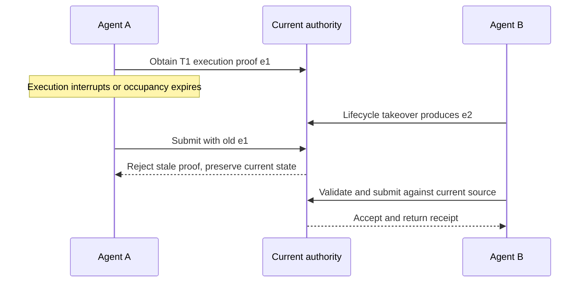

# Work graphs, authority, and peer collaboration

Multiple peers may see one Todo. Work ownership, current write authority, and execution-instance identity need separate checks so a stale instance cannot submit after handoff.

This chapter explains how the work graph represents collaboration and where claims, leases, and fences constrain writes.

## Start from a bad ending

The following teaching counterexample assumes no commit fence. It is not a trace of the current protected path.

```text
09:00  agent-a selects Todo T, acquires a lease, version=1, ttl=600s.
09:00  agent-a starts editing code, then breaks off to run a long test.
09:10  agent-a's renew fails: the host process is preempted, or the network hiccups.
09:10  The retry never succeeds, but the process stays alive, still holding "I own T."
09:11  The lease expires. agent-b sees T unheld, acquires it, version=2.
09:14  agent-b finishes, writes back version=2, validation passes, quota charges once.
09:20  agent-a's long test finally returns, and it writes back on its version=1 judgment.
09:20  agent-a's writeback succeeds too.
```

Both writebacks at 09:14 and 09:20 return success. The later one overwrites the earlier, T now carries only agent-a's result, and agent-b's work disappears from state. Quota, meanwhile, honestly recorded two charges.

That is a **lost update**, and it is also a **stale holder**. It is harder to spot than two agents corrupting the same file at once: nobody errored, state is self-consistent, the books are self-consistent, and exactly one genuinely finished piece of work is gone. When someone later asks what agent-b did that day, the read model cannot answer.

## Why "claim it and nobody will grab it" does not solve this

The instinct is to claim the Todo before starting, so that anyone seeing `claimed` stays away.

A claim says "this peer currently owns the work," and it helps quota and other Agents avoid duplicate selection. It **does not prove the holder is alive**, and it does not prove the holder is still in the right worktree. At 09:10 above, agent-a's process was alive and the claim was still in its name, yet its judgment was ten minutes stale.

So the natural patch — "check that I still hold it right before writing back" — does not save you either. The check and the write are two independent operations separated by a process scheduling boundary; if the lease transfers after the check passes and before the write lands, checking harder only narrows the window without closing it.

The hard problem is that **a write must either come from the execution instance that currently holds authority, or not land at all**. That judgment cannot happen before the write; it can only happen at the instant the write commits. Which means a Todo has to be more than an independent list entry — it has to be a graph that expresses who is advancing me, whom I advance, and who replaced me.

## Why claiming work does not remove commit checks {#design-choice}

A claim on T1 does not authorize A to submit indefinitely. B may legitimately take over after A stalls, or acceptance may change. Collaboration ownership and proof for this write need separate records.

| Approach | What it solves | Remaining gap |
| --- | --- | --- |
| Record a claim | Peers know who is responsible | Does not alone establish the old instance may still write |
| Check lease / revision before execution | Reject stale inputs early | State may change before commit |
| Check in the applicable writer's commit boundary | Reject stale proof and protect current source | Conflicting callers must reread, revalidate, or hand off |

The diagram applies only where the relevant lease/instance fence is enforced. `e1` and `e2` are teaching labels, not complete requests. Default legacy mode does not enforce identical fences on every writer.



B's receipt proves that submission, not authority for other work. Recovering a historical receipt for A is also distinct from permitting A to create new effects.

## Goal, Acceptance, and per-Agent Vision

Goal, Acceptance, and per-Agent Vision work at different levels, and only together do they assemble the full basis for "who should advance this":

| Object | Scope | Question it answers |
| --- | --- | --- |
| Goal | Project | What outcome must the project achieve? |
| Acceptance | Goal or explicit delivery stage | Which observable evidence is sufficient for completion? |
| Agent Vision | `agent_id` | What direction, role scope, acceptance summary, and replan trigger does this peer currently own? |

Vision goes beyond a general product vision, yet it is bounded state itself, not a free-form scratchpad. [`goal_vision_replan_contract_v0`](https://github.com/huangruiteng/loopx/blob/main/docs/reference/protocols/goal-vision-replan-contract-v0.md) defines it as bounded per-Agent execution-routing state, which can include `role_scope`, `vision_summary`, `acceptance_summary`, `advancement_policy`, `replan_trigger_summary`, and the latest bounded patch. After material progress, a peer records whether Vision was patched, unchanged with a reason, retired, or superseded; without that, quota may report `vision_checkpoint_missing` and demand replan evidence rather than quietly continuing.

This protects against two kinds of drift: a Todo queue that stays busy without advancing Goal acceptance; and several peers working on one Goal while each keeps an invisible private account of the next step.

## Design: the work graph and its five relations

A Todo is a node in the work graph and the smallest executable or waiting unit. It can carry role and priority, `task_class` and `action_kind`, dependency and resume condition, required capability and write scope, claim / lease / continuation policy, and Gate, evidence, successor, and supersession refs. It is far smaller than a complete project plan, and it should not be merely a reminder inside a prompt.

Edges express why one node affects another. Among the `relation` values allowed by [`task_graph_projection_v0`](https://github.com/huangruiteng/loopx/blob/main/docs/reference/protocols/task-graph-projection-v0.md), these are the decisive ones:

```text
blocks        until A closes, B cannot become a legal candidate
validates     evidence from B decides whether A is genuinely complete
repairs       after A fails, B diagnoses and recovers
hands_off_to  after A ends, B takes over, staying unclaimed until someone does
supersedes    B replaces A while preserving lineage
```

Every edge must name `from_node_id`, `to_node_id`, `relation`, and a compact public-safe `reason`. The load-bearing constraint is the last clause in that sentence: **an edge does not grant permission to run a command or mutate state**. It can explain who is advancing T and let review trace dependencies, but it cannot stand in for the claim, lease, and fence discussed below.

`repairs`, `audits`, and `continues` are lineage relations rather than lifecycle commands, derived from existing run history, todo/gate metadata, and compact blocker or validation writebacks: `repairs` says a repair or replan node intends to recover a work lane, and `audits` says compact run evidence reviews, checks, or bounds one. Conflating these relations with "who may write" is exactly where the 09:20 bug above comes from.

Those relations are the premise for the rest of this chapter. Without them, "who is advancing T" can only be guessed from chat history.

### Five common work classes

| Class | Owner | Typical meaning |
| --- | --- | --- |
| `advancement_task` | Agent | Current implementation, documentation, analysis, or repair work |
| `user_gate` | User/controller | A related action cannot legally continue without a decision |
| `user_action` | User/controller | A person should act, but independent Agent work need not stop |
| `continuous_monitor` | Agent/Host | Observe an external condition on a cadence and advance only on material change |
| `blocker` | Agent/controller | An executable condition is missing and needs a concrete recovery path |

Human-readable Todo text is useful; machine routing cannot guess the work class from prose alone.

### The frontier is computed, not listed

The **frontier** is the set that survives every current guard:

```text
open todos
  -> dependency and resume
  -> decision scope and authority
  -> agent claim and lifecycle authority
  -> host capability
  -> workspace and write scope
  -> freshness and evidence
  -> current frontier
```

Therefore: open does not mean runnable; priority does not bypass a Gate; claimed does not prove the work is still executable; available capability does not grant authority; and Todo completion does not prove Goal completion.

[`task_graph_projection_v0`](https://github.com/huangruiteng/loopx/blob/main/docs/reference/protocols/task-graph-projection-v0.md) can render those relations as a graph, but the graph itself remains a read-only projection. Real state changes still pass through Todo, Gate, refresh, and event protocols.

## Who may write: claim, lease, and lifecycle authority

These three concepts are often collapsed incorrectly, and the timeline above is exactly what collapsing them produces.

### Claim: soft work ownership

A claim helps avoid duplicate selection; it is a collaboration signal and nothing stronger.

### Lease: an occupancy credential for one execution

A lease serves explicit mutual exclusion that needs TTL, renew, transfer, version/CAS, or an idempotent identity. It suits expensive or effectful execution occupancy, but it does not automatically replace the Todo lifecycle. An implementation may have a claim without a lease; may hold a valid lease while a Gate still blocks execution; may reassign after lease expiry; and may deliberately not carry the old lease through a handoff.

### Lifecycle Authority: who may change state

A claim answers who plans to execute; lifecycle authority answers who may complete, supersede, reassign, or run a special override. Delegating one lifecycle mutation to a peer does not promote that peer into a global leader.

### Fence: verified at the moment of commit

What actually stops the 09:20 writeback in `task_lease_v0` is the **execution-instance fence** formed by the acquire key and the returned version. A lifecycle writer cannot be admitted on `agent_id` alone, because several host processes may share one registered peer identity. While an effective lease exists, `todo complete` and `todo supersede` must both carry the idempotency key and expected version, and must hold the lease lock through canonical writeback; a missing, stale, or mismatched fence is rejected, and it is rejected before any successor is created.

Release does not delete the record. It leaves an inactive terminal record, so a later acquire advances the per-todo version and `lease_epoch` instead of resetting the version to 1. This test walks the whole sequence:

```bash
uv run --extra test pytest tests/control_plane/test_canonical_lease_acquire.py -q
```

It asserts that after acquire, `lease.version == lease.lease_epoch == 1`; that replaying with the same `--idempotency-key` returns `idempotent: true` with `acquired: false` and a `lease` identical to the original receipt; that reusing that key after release is refused as `idempotency_key_reuse`; and that acquiring again under a new key moves version to 3 while `lease_epoch` moves to 2. It closes by confirming neither the lease file nor the state file lingers — admission and cleanup are two faces of one rule.

## Authority boundary: who is refused, and on what grounds

Authority follows from several orthogonal axes rather than one switch, and a single switch cannot express it. Collapse any two axes and the judgment "may this happen" loses its basis.

| Boundary | Primary question | It does not prove |
| --- | --- | --- |
| Decision scope | Has the required user/controller decision been granted? | Whether this Host can execute |
| Capability gate | Does the Host/runtime provide the required ability? | Whether the action is authorized |
| Workspace guard | Is the Agent in the correct repository, worktree, and write scope? | Whether the result is correct |
| Write fence | Does this write come from the execution instance holding authority now? | Whether the result is correct |

Decision scope comes from [`decision_scope_v0`](https://github.com/huangruiteng/loopx/blob/main/docs/reference/protocols/decision-scope-v0.md), which requires a user or controller decision to name `kind`, `granularity`, `scope_key`, plus optional expiry, decision id, and reason. An Agent Todo may declare `required_decision_scopes`, and an unresolved Gate blocks the work only when its scope covers the selected action:

```text
Gate G1
  decision_scope = public_claim:action:bilingual_homepage

Todo A
  required_decision_scopes = public_claim:action:bilingual_homepage

Todo B
  repair internal link checker
  required_decision_scopes = none
```

G1 blocks A, not B. If a projection only says "waiting for user confirmation" with no scope relation, the right move is to repair the projection or ask the concrete question; you may neither invent Agent authority nor assume a global freeze. A `user_action` is weaker yet: a person seeing a reminder does not approve production, publication, or private reads.

The workspace guard is a separate refusal ground. When a selected Todo writes repository state, the executor must sit in a linked independent worktree whose origin matches `task_repository`; a matching repository is only necessary, and the canonical checkout may still be rejected. `task_repository` is a credential-free repository identity that selects the target repository for workspace isolation and **grants no write authority**, nor does it replace claim, lease, Goal boundary, or repository maintainer policy.

### A refusal must state its grounds

A boundary is useful half because it refuses and half because it **explains why**. When the legacy coordination writer is fenced, the error carries a field-level remediation rather than a vague "write failed":

```text
legacy coordination writer is fenced; use the promoted canonical authority
(file_v0) for goal goal-a; fence fence-a; the primary record was not changed
```

`tests/control_plane/test_legacy_coordination_writer_fence.py` pins that shape item by item: without a fence the default behavior holds and TypeScript is never started; with a fence present the raised exception has `code == "legacy_coordination_writer_fenced"`, its payload carries `reason_code`, `authority_mode`, and `fence_id`, and the message always ends with `the primary record was not changed`. The test further asserts that the same remediation renders identically on the Python and TypeScript sides, and covers the `unknown_fail_closed` behavior when `authority_mode` is absent. A missing field like `fence_id` does not degrade into vague wording; it fails closed.

## Multi-peer collaboration: keeping ownership, evidence, and review accountable

LoopX live multi-agent work uses an **equal peer** model. An Agent id is a work identity; it proves neither a Host surface nor an organizational hierarchy, and a `codex-*` name alone cannot prove whether Codex App or Codex CLI is running the work. That boundary fixes the default shape of collaboration: completing one item does **not** grant an Agent the rest of the Goal, and the default continuation is `independent_handoff`, where the successor stays unclaimed until any qualified peer takes it, unless an explicit assignment says otherwise.

A handoff transfers bounded state references, not a transcript copy. A bounded handoff should at minimum let the receiver reconstruct: Goal, Todo, and stop condition; current revision and workspace; Gate, capability, and authority boundary; evidence and material references with freshness; next action and validation; and which material was truncated or left in a private store.

### The receiver must re-verify everything

A handoff does not transfer permission. The prior Agent's receipt does not grant the new Agent any source permission, and an old workspace observation cannot prove the environment is unchanged. The receiver still reruns current guards.

`tests/control_plane/test_canonical_lease_lifecycle.py` turns that rule into an executable one: it deliberately places a lease file that contradicts the provider on the legacy path (`version: 99`, owner `stale-agent`), then requires every `task-lease` command to read only the provider. After a transfer, `lease.owner` becomes `agent-b`, version moves 3 to 4, and `lease_epoch` moves 7 to 8. If agent-a then tries to release with its old proof, it is refused as `version_mismatch`, and the provider head is unchanged byte for byte. The test closes by asserting that legacy file is untouched and the state file never exists.

### One source per piece of evidence

When peers run in parallel, the easiest thing to break quietly is evidence ownership. Each implementation Todo writes back an exact revision, validation, and completion evidence; downstream work enters the frontier on dependencies and fresh readback, not on the sentence "they should be done by now."

Cross-repository dependencies must also carry repository identity. `resume_when=pr_merged:#123` holds only when the Todo's GitHub `task_repository` matches the merge-event repository; across repositories, use `pr_merged:owner/repo#123`. Missing repository identity fails closed rather than guessing from the PR number.

### Work that does not suit multiple peers

| Work type | Parallel policy |
| --- | --- |
| Research, source location, triage, read-only review | Fan out, then collect bounded evidence |
| Implementation in different repositories | Bind each Todo to its own `task_repository` and worktree |
| One repository with disjoint write scopes | Parallelize only when scopes are proven disjoint and validation is independent |
| One file or shared schema/state machine | Default to serial work or split an owner/seam first |
| External effects, merge, or publish | Keep scoped Gates and repository policy authoritative |

The last row deserves emphasis: when the work is strongly serial — each step consuming the previous step's output, or several parties sharing one state machine — leases and fences only guarantee that two writes never both succeed; they cannot manufacture parallelism. Splitting such work across peers buys a queue of waits and a longer critical path. A claim is a soft owner, not a lock; only Hosts with a demonstrable concurrent-write conflict need the optional `task_lease_v0`.

### How work resumes after waiting

A work graph must express not only "A before B" but also how the item re-enters decision-making once the wait ends. A resume condition is machine-readable:

```text
todo_done:<todo-id>
pr_merged:<pr-id>
capacity_available:<capability>
monitor_changed:<monitor-todo-id>
```

A satisfied condition does not make the original Todo runnable right away. The old task may already be stale and need a successor replan — precisely why resume must be a structured condition rather than "we will see once it is done."

Once a Todo completes, the next unit of work has four legal forms:

- **Successor**: creates the next identified unit of work, moving "what happens next" into the durable graph rather than leaving it in the completing Agent's chat;
- **Supersede**: replaces obsolete work with a new Todo while preserving lineage, instead of disguising invalidated work as done;
- **No-follow-up**: when no successor is necessary, records why acceptance is closed or why later work is outside the Goal; a structured record is far more auditable than "looks finished";
- **Continuation policy**: `same_agent_non_delivery` lets the same peer perform a bounded, non-independent follow-up, while `independent_handoff` leaves the successor unclaimed.

### One goal across repositories

When one release changes four repositories, there is still one Goal:

```text
Goal: ship-cross-repo-release
├── Todo A -> repo-a -> agent-a -> worktree-a
├── Todo B -> repo-b -> agent-b -> worktree-b
├── Todo C -> repo-c -> agent-c -> worktree-c
└── Todo D -> integration verification -> waits for A/B/C evidence
```

A, B, and C may run in parallel, but D cannot infer readiness from the prose "they should be done." Each implementation Todo writes back an exact revision, validation, and completion evidence; D enters the frontier only after dependencies and fresh readback agree.

## Cost and boundary: what this design gives up

Every rule above buys one property and charges for it, and the charges decide when not to count on the machinery.

**Cost one: a lease must be renewed, and a failed renewal interrupts work.** The failed renew at 09:10 is the design working, not a defect: the execution instance could not prove it still held authority, so its later writes are refused. For long tasks this means TTL must be sized for the worst case. Too short, and an ordinary compile or long test pushes the holder out; too long, and a crash leaves a gap other peers wait through. In `test_canonical_lease_renew.py`, each renew advances version by exactly one (1→2→3→4) while `lease_epoch` stays put, which shows that renewal extends the same execution whereas a fresh acquire starts a new one.

**Cost two: a write may be refused, and the caller must handle the refusal.** A fence is not a suggestion; it will fail a writeback that looks routine. A caller cannot treat `version_mismatch` as a transient error and retry the same key — `test_canonical_lease_acquire.py` asserts that reusing one `--idempotency-key` after release is refused as `idempotency_key_reuse`, and that acquiring a Todo already marked done is refused as `todo_not_open`. The correct response is to re-read the current version, re-acquire, and re-validate, rather than grinding on a replay.

**Cost three: fencing spreads into other corners of the writeback path.** `tests/control_plane/test_split_root_todo_writeback_fence.py` records exactly this: when `--runtime-root` separates from the registry root, the fence must land on **the effective root**, and must refuse before any data collection begins. It asserts a fenced writeback leaves state bytes unchanged and returns `local_authority_todo_list_unavailable` together with `legacy_fallback_used: false`. Errors of this shape surface across monitor poll, Turn repair, and validated completion paths.

**Boundary one: neither claim nor lease proves "the holder is alive."** They say whether a write may land, not whether the holder's process is healthy or its context fresh. An agent holding a valid lease may still be advancing on an hour-old judgment.

**Boundary two: the work graph is a read-only projection.** The relations rendered by `task_graph_projection_v0` cannot be used to change state; seeing an edge does not license editing a Todo.

**Boundary three: automatic orchestration is not promised today.** The product does not promise "point LoopX at a root folder and four Goals run in parallel," nor a cloud coordinator that picks devices and claims work. Bounded multi-agent orchestration can enable child-agent planning, but peer identity, claim, workspace guard, Gate, and writeback stay per-Todo contracts, and cross-device online authority still needs separate service and runtime qualification; local collaboration does not establish its delivery.

The current `handoff_mode` selects ownership rules. Default `legacy` retains compatibility paths for soft claims and hard leases; `soft_claim` and `hard_lease` have distinct constraints. Some legacy terminal paths allow `terminal_fence_not_required`.

Stale-instance protection therefore belongs to a specific writer, mode, and lease/fence check. Enabling one mechanism does not cover every write entrypoint. The following tests prove named boundaries, not system-wide exclusivity.

## Named failures: what these constraints stop

Talking abstractly about concurrency safety convinces nobody. Each of the four scenarios below has a corresponding test you can run.

**A stale holder's writeback is refused.** This is the 09:20 moment from the opening. In `test_canonical_lease_lifecycle.py`, after a transfer the old holder releases with its old version and receives `version_mismatch`, and the test asserts the provider head is exactly what it was after the transfer. A lost update stops being two silently merged pieces of work and becomes one explicit refusal.

**The fence blocks a superseded writer.** `test_legacy_coordination_writer_fence.py` pins `legacy_coordination_writer_fenced`: the write is stopped, the payload names which canonical authority to use and which `fence_id` is in force, and the closing clause states the primary record was not changed. It also asserts that a fence under a `--runtime-root` override blocks the legacy writer, and that the fenced transaction body never runs at all.

**The fence must land on the effective root.** `test_split_root_todo_writeback_fence.py` covers split roots: when the registry source is fenced, the original fence still applies even through an override that shares the same source state, and state bytes stay unchanged, while an unfenced override writes its receipt normally. Without this, a fence would be decoratively bypassable.

**Fail closed when repository identity cannot be resolved.** `pr_merged:#123` can resolve through the Todo's GitHub `task_repository`; an explicit `owner/repo#123` binds the target directly. Refuse when neither source resolves the repository.

Corresponding tests: `tests/control_plane/test_canonical_lease_acquire.py`, `tests/control_plane/test_canonical_lease_renew.py`, `tests/control_plane/test_canonical_lease_lifecycle.py`, `tests/control_plane/test_legacy_coordination_writer_fence.py`, and `tests/control_plane/test_split_root_todo_writeback_fence.py`. These assertions serve as the executable evidence for the design, and are far more than illustration.

## Protocol reading routes

For work-graph or authority changes, start from the question you are asking:

- [`task_graph_projection_v0`](https://github.com/huangruiteng/loopx/blob/main/docs/reference/protocols/task-graph-projection-v0.md): the read-only graph of dependency, Gate, validation, repair, and handoff;
- [`decision_scope_v0`](https://github.com/huangruiteng/loopx/blob/main/docs/reference/protocols/decision-scope-v0.md): Gate coverage and fail-closed behavior;
- [`goal_vision_replan_contract_v0`](https://github.com/huangruiteng/loopx/blob/main/docs/reference/protocols/goal-vision-replan-contract-v0.md): per-Agent Vision, checkpoints, and replanning;
- [`local_state_write_correctness_v0`](https://github.com/huangruiteng/loopx/blob/main/docs/reference/protocols/local-state-write-correctness-v0.md): `write_intent`, revision conflict, and lease conflict semantics;
- [Peer Agent Runtime v1](https://github.com/huangruiteng/loopx/blob/main/docs/reference/protocols/peer-agent-runtime-v1.md): equal peer identity and continuation;
- [Host Integration Surface](https://github.com/huangruiteng/loopx/blob/main/docs/reference/protocols/host-integration-surface-v0.md): claims, the execution-instance fence, optional leases, and Host boundaries.

For changes involving equal peers, lifecycle authority, handoff, dependencies, or successors, continue to [Control-Plane Course Lesson 5](/loopx/docs/development/control-plane-course/05-work-graph-and-peers/). The course provides combined cases and source walkthroughs; this chapter preserves the work-graph and authority model external contributors need.

## When the Goal ends: a few more checks

One Todo leaving the frontier and a whole Goal terminating are different events. Goal terminal closure additionally confirms:

- acceptance is satisfied;
- no unresolved Gate remains;
- no due monitor, pending external effect, or stale readback remains;
- no successor, replan obligation, or acceptance gap remains;
- no retryable postcondition remains;
- no-follow-up is explicit where required.

What unites these six is that "every Todo is done" can mask all of them.

## Invariants

Six claims you can check yourself.

1. **Check whether this write is protected by an instance or lease fence.** `hard_lease` and default legacy paths differ; a claim does not prove that every writer enforces instance exclusivity.
2. **A write is judged legal at commit, not at preparation.** A writeback carrying a stale version must be refused rather than written and reconciled later.
3. **Replay safety does not license key reuse.** Replaying the same logical write under one `idempotency_key` is idempotent; reusing that key with different semantics is refused as `idempotency_key_reuse`.
4. **A failed renewal is a legal outcome.** Interrupting work when the holder cannot prove it still holds authority beats letting a stale holder finish; size TTL for the worst-case task.
5. **A handoff transfers references, not permission.** The receiver reruns current guards, and an old receipt grants the new Agent no source permission.
6. **Only three routes leave the active frontier.** Completed with evidence, superseded with lineage, or blocked/deferred with a resume contract; deleting an item from a list is not a lifecycle transition.

These six answer one question: **when several peers are present on one goal and nobody can coordinate in real time, what lets the system know who may write right now?** This chapter gave LoopX's answer at the work-graph scale. The next chapter compiles that answer into one governed Turn: who acts, who waits, and when writeback and spend are legal.
